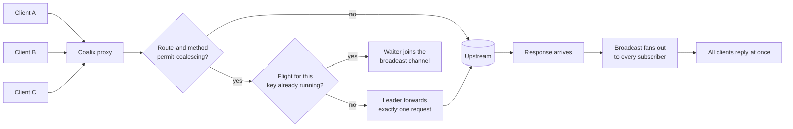
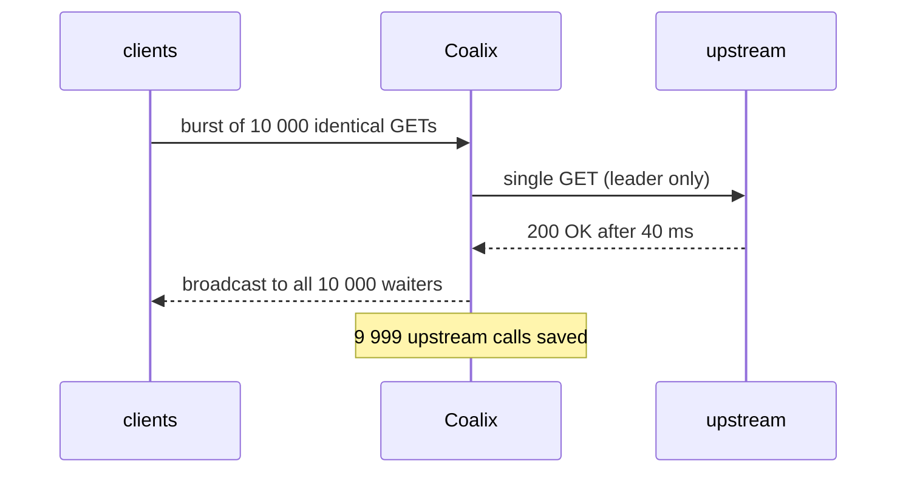

<div align="center">

# Coalix

**Zero-config, blazing-fast Request Coalescing Reverse Proxy — forged in Rust.**

*10,000 identical requests in. A single backend query out. Everybody gets the answer.*

[](https://github.com/coalix-rs/coalix)
[](https://www.rust-lang.org)
[](https://tokio.rs)
[](https://hyper.rs)
[](#-license)
[](#-contributing)

**English first — ภาษาไทยทีหลัง: every section ships both languages.**

</div>

---

## The Problem vs. The Solution

### 💥 The problem: the Thundering Herd

Picture a flash sale. At 12:00:00 exactly, 10,000 buyers tap *Buy*, and 10,000 **identical** `GET /api/products/42` requests hit your edge in the same second. When the hot cache row has just expired — or was never there — every single request marches straight into the database:

1. **10,000 identical queries** arrive instead of one.
2. CPU, I/O and the connection pool saturate; *unrelated* requests start timing out too.
3. Clients time out, retry, and double the herd (**retry storm**).
4. Dashboards light up like a domino: one cold key just took down the whole site.

This is the **thundering herd problem** (also the *hot-key problem*, and *cache stampede* on steroids). It recurs wherever many concurrent readers share one expensive resource: databases, microservices, third-party APIs, LLM inference endpoints.

### ✅ The solution: request coalescing

Coalix parks identical in-flight requests and answers them **all from one upstream call**:

- the first arrival becomes the **leader** — it alone is forwarded upstream;
- every later identical request becomes a **waiter** — parked in memory, costing the backend nothing;
- when the backend replies, the response is **broadcast** to every subscriber at once;
- the absorbed requests are counted as **saved requests** in `coalix_saved_requests_total`.

| | Without Coalix | With Coalix |
|---|---|---|
| Upstream calls during the herd | 10,000 | **1** |
| DB rows read per flash sale | 10,000 | **1** |
| p99 latency at 10k concurrency | collapses | bounds to *one* backend query |
| Retry storm | cascades | bounded by timeouts + circuit breaker |
| Failure containment | domino effect | upstream isolated, clients get a fallback |

---

## How It Works

Coalix sits between clients and your upstream. Every request runs three cheap
decisions before any I/O happens:

1. **Route** — the ordered route table answers "which policy applies to this path";
   the first match wins, and an unmatched path falls back to the global default.
2. **Whitelist** — only the coalescing methods (GET and HEAD by default) may
   enter the engine at all; mutations pass straight through to the upstream.
3. **Flight** — a *key* is derived from method, path, and the configured key
   headers. If a flight for that key is already in the air you become a
   **waiter**; otherwise you become the **leader** and fetch once.



And in time order:



While the leader waits, followers are parked on a tokio broadcast channel —
zero polling, zero upstream work. Non-coalescable requests (POST, checkout,
search) and cache hits never touch the flight table.

---

## Architecture

One Tokio runtime, zero thread-per-connection, nothing blocking on the async
path. The request pipeline is a straight line with a side door for waiters:

```text
  clients / HTTP
        │
        ▼
  hyper front server ──► router ──► coalescer ──► upstream client pool
        │                   │             │              │
        │                   │             │              └── single in-flight
        │                   │             │                  request per key
        │                   │             └── flight map (DashMap) +
        │                   │                 broadcast channel waiters
        │                   └── ordered route table
        │                       (first match wins)
        └── metrics + structured logs along the way
```

| Module | Responsibility | Status |
|---|---|---|
| "src/config.rs" | zero-config model, YAML + COALIX_* env, validation, 11 unit tests | done |
| "src/main.rs" | CLI, preflight banner, tracing setup, --check, --print-config | done |
| "src/proxy/" | hyper front server, upstream client pool, body streaming | done |
| "src/coalescer/" | flight map, single-flight leader/follower, waiter broadcast | done |
| "src/cache/" | micro-cache with stale-while-revalidate | done |
| "src/resilience/" | circuit breaker and fallback | done |
| "src/metrics/" | counters, histograms, Prometheus exposition | done |
| "benches/, tests/" | herd-simulation integration test, criterion benchmarks | done |
| "examples/slow_backend.rs" | slow dummy upstream for sandbox load tests | done |
| ".github/workflows/" | CI: fmt, clippy -D warnings, tests, MSRV 1.85 | done |

Design rules the whole codebase obeys:

- **No lock ever wraps I/O** — waiters synchronize through message passing
  (a tokio broadcast channel), never through a mutex guard held across await.
- **Backpressure is explicit** — waiter caps, dedup windows, connect and
  request deadlines: every queue in the system has a documented bound.
- **Correctness over cleverness** — a POST is never deduplicated, a response
  with a Set-Cookie is never broadcast, and a waiter always has a deadline.
- **Zero-config by default** — every knob has a sensible default already
  encoded in the type system, not in documentation.

---

## Features

- **Zero configuration** — run the binary and it already listens on port 8080
  and forwards to a local upstream on port 3000.
- **Request coalescing (single-flight)** — a herd of N identical GETs
  collapses into one upstream call; every client still gets the full response.
- **Ordered smart routing** — exact and prefix matchers, first match wins,
  per-path coalesce on/off, so "/api/checkout" is never shared while
  "/api/products/" always is.
- **Safe method whitelist** — only whitelisted methods (GET, HEAD by default)
  enter the engine; mutating verbs bypass it entirely.
- **Bounded waiting** — waiters park with a deadline and a per-flight cap, so
  an in-flight response can never exhaust memory or descriptors.
- **Micro-cache with stale-while-revalidate** (Phase 3) — hot keys are fetched
  at most once per TTL; stale bytes keep serving while a refresh runs.
- **Circuit breaker and fallback** (Phase 3) — a failing upstream degrades to
  a configurable canned response instead of cascading a retry storm.
- **Prometheus metrics and structured logs** — labelled request counters,
  coalescer depth, latency histograms, breaker/cache gauges, JSON logs.
- **Docker-native** — Dockerfile and docker-compose.yml ship in the repo.

---

## Quick Start

### From source

```bash
cargo build --release
./target/release/coalix --check --config config/coalix.example.yaml
./target/release/coalix    # zero-config mode: :8080 → http://127.0.0.1:3000
```

### Validate a config before deploying

```bash
coalix --config config/coalix.example.yaml --check      # exit 0 only if valid
coalix --config config/coalix.example.yaml --print-config
```

### With Docker

```bash
docker compose up -d
curl -i http://localhost:8080/api/products/42
```

### Watch the herd collapse

```bash
# 200 clients request the same path at once
hey -n 200 -c 200 http://localhost:8080/api/products/42
# the upstream access log records ONE request for those 200
```

---

## Configuration

Every key is optional. Precedence: built-in defaults, then the YAML file, then
"COALIX_*" environment variables. Validate with "--check" before deploying.

```yaml
server:
  listen: '0.0.0.0:8080'
  max_connections: 65536
  tcp_nodelay: true

upstream:
  base_url: 'http://127.0.0.1:3000'
  connect_timeout_ms: 1000
  request_timeout_ms: 5000
  max_idle_per_host: 128

coalescing:
  enabled: true
  default_coalesce: true
  max_inflight_waiters: 4096
  max_wait_ms: 2000
  dedup_window_ms: 50
  coalesce_methods: ['GET', 'HEAD']
  key_headers: ['accept-language']

routes:            # ordered, first match wins
  - name: product-detail
    path: '/api/products/'
    matcher: prefix
    coalesce: true
  - name: checkout
    path: '/api/checkout'
    matcher: exact
    coalesce: false   # this path is never shared

cache:
  enabled: true
  ttl_ms: 2000
  stale_while_revalidate_ms: 30000
  max_entries: 10000

resilience:
  circuit_breaker:
    enabled: true
    failure_threshold: 5
    sampling_window_ms: 10000
    open_timeout_ms: 30000
    half_open_max_calls: 3
  fallback:
    enabled: true
    status_code: 503
    body: 'upstream unavailable - coalix fallback'

observability:
  metrics_path: '/metrics'
  log_level: info        # trace | debug | info | warn | error
  log_format: text       # text | json
```

Environment overrides, in full:

| Variable | Field it overrides |
|---|---|
| "COALIX_LISTEN" | "server.listen" |
| "COALIX_UPSTREAM_BASE_URL" | "upstream.base_url" |
| "COALIX_COALESCING_ENABLED" | "coalescing.enabled" |
| "COALIX_CACHE_ENABLED" | "cache.enabled" |
| "COALIX_LOG_LEVEL" | "observability.log_level" |
| "COALIX_LOG_FORMAT" | "observability.log_format" |

Boolean overrides accept "true/false", "1/0", "yes/no", and "on/off";
anything else fails fast with a precise error, never a silent default.

---

## Observability and Demo

A single Prometheus endpoint (default "/metrics", reserved ahead of routing —
a scrape never routes, caches, coalesces, or dials) plus two log encodings.
Family names are frozen, so dashboards written today keep working:

| Metric | Meaning |
|---|---|
| "coalix_requests_total{route,method,coalesced}" | handled requests; "coalesced" is the routing decision |
| "coalix_upstream_requests_total" | dials that actually left the proxy |
| "coalix_saved_requests_total" | herd members answered from a shared flight |
| "coalix_flights_active" | flights tracked (airborne plus dedup window) |
| "coalix_waiters" | clients parked right now |
| "coalix_wait_seconds" | time a waiter spent parked (histogram) |
| "coalix_upstream_seconds" | upstream dial latency: leader, bypass, revalidation (histogram) |
| "coalix_cache_hits_total" / "coalix_cache_misses_total" | micro-cache outcomes (fresh + stale hits) |
| "coalix_cache_stores_total" / "coalix_cache_entries" | cache writes and resident rows |
| "coalix_cache_stale_hits_total" / "coalix_cache_revalidations_total" / "coalix_cache_evictions_total" | stale-while-revalidate detail |
| "coalix_breaker_state" | 0 closed, 1 half-open, 2 open |

Two log encodings, switchable at runtime through the environment:

```bash
COALIX_LOG_LEVEL=debug coalix                       # more detail, no restart
COALIX_LOG_FORMAT=json coalix 2>/dev/null | jq .    # structured, one object per line
```

### Demo script

```bash
# terminal A: your upstream on :3000 — try `cargo run --example slow_backend`

# terminal B: the proxy
coalix --config config/coalix.example.yaml

# terminal C: aim the herd at the PROXY, not the upstream
hey -n 500 -c 100 http://localhost:8080/api/products/42

# terminal C again: count what the herd saved
curl -s http://localhost:8080/metrics | grep coalix_
```

The upstream log shows one request; every client still receives a 200.

---

## Sandbox: slow backend + live load test

Rehearsing coalescing needs something slow and honest behind the proxy.
`examples/slow_backend.rs` is a tiny upstream tailored to exactly that job:

- answers on the zero-config default origin **`127.0.0.1:3000`**;
- sleeps **500 ms** before every response, leaving a wide flight window;
- prints one log line per call that *actually* reaches it;
- echoes a global `seq` counter in the body, so "one backend visit" is
  visible to `curl` as well;
- `GET /fail` returns **500** after the same delay — a handle for driving the
  circuit breaker and the fallback live.

| Variable | Default | Meaning |
|---|---|---|
| `SLOW_BACKEND_ADDR` | `127.0.0.1:3000` | bind address (a bare port, e.g. `3000`, works too) |
| `SLOW_BACKEND_DELAY_MS` | `500` | artificial latency per response (`0` turns it off) |

### Three terminals

```bash
# terminal A — the slow upstream: one log line per REAL call
cargo run --example slow_backend

# terminal B — the proxy (zero-config already targets :3000)
cargo run --release
# or with the example file: coalix --config config/coalix.example.yaml

# terminal C — the herd, aimed at the PROXY (:8080), never the upstream (:3000)
oha -n 10000 -c 100 http://127.0.0.1:8080/api/products/42      # cargo install oha
wrk  -t4 -c100 -d10s http://127.0.0.1:8080/api/products/42
```

### Reading the results

1. **terminal A stays quiet** — one line per flight, not one per client;
2. **the bodies tell the story** — every replayed response in a wave carries
   the same `seq=N`; once the micro-cache absorbs the key the counter stops
   stepping entirely (hits without upstream visits);
3. **`/metrics` quantifies it**:

```bash
curl -s http://127.0.0.1:8080/metrics \
  | grep -E '^(coalix_saved_requests_total|coalix_upstream_requests_total|coalix_wait_seconds_(count|sum)) '
```

`coalix_saved_requests_total` is the herd you absorbed, the two
`coalix_wait_seconds_*` numbers are the parking time you reclaimed, and
`coalix_upstream_requests_total` is what the backend actually paid.

Two knobs for cleaner readings:

- the micro-cache muddies a *pure* coalescing measurement — after the first
  store the totals stop moving because hits never dial. Run with
  `COALIX_CACHE_ENABLED=false`, or spread the load over distinct paths
  (`/api/products/1..N`), to measure flights alone;
- to watch the breaker instead:

```bash
oha -n 200 -c 10 http://127.0.0.1:8080/fail    # five failures trip the circuit
curl -s http://127.0.0.1:8080/metrics | grep '^coalix_breaker_state '   # samples as 2 (open)
# terminal A's log freezes: Coalix now answers the 503 fallback without dialing
```

---

## Under the Hood

### The flight key

The coalescing key is deliberately boring and deterministic: the HTTP method,
the request path, then each configured key header in sorted order. Two requests
share a flight only if all three match byte for byte — that is what makes a
broadcast safe for every subscriber.

### Leader, waiter, deadline

- the **leader** owns exactly one upstream request and one bounded deadline
  ("upstream.request_timeout_ms");
- each **waiter** parks with its own deadline ("coalescing.max_wait_ms") and
  may leave at any moment — a client disconnect drops only that waiter;
- when the leader finishes, the response fans out through a broadcast channel
  and the flight leaves the map after the dedup window ("dedup_window_ms"),
  which shortens the thundering tail of every burst;
- a per-flight waiter cap ("max_inflight_waiters") means a pathological key
  sheds load rather than growing the map without bound.

### Micro-cache (Phase 3)

Successful idempotent responses shorter than a configurable size enter a tiny
TTL cache. While fresh, hits answer without touching the flight map at all.
After expiry, stale bytes are served immediately and one background refresh
keeps the value warm — stale-while-revalidate, so a hot key triggers at most
one upstream call per TTL even under continuous traffic.

### Circuit breaker (Phase 3)

Failures inside a rolling window trip the breaker. While open, every request
short-circuits to the fallback response without waking the upstream; a cooldown
then admits a trickle of half-open probes, and the first success closes the
circuit again. The herd experiences one stable degraded answer instead of a
retry storm.

---

## Tests & Benchmarks

```bash
cargo test       # 70 unit tests + 6 end-to-end simulations on real sockets
cargo bench      # criterion micro-benchmarks (benches/hot_paths.rs)
cargo clippy --all-targets -- -D warnings
cargo fmt --check
```

What the suite pins down today:

1. configuration: zero-config defaults, whitelist behaviour, first-match
   routing, segment-boundary prefixes, env precedence, YAML round trip;
2. coalescer: leader/waiter/tail outcomes, parked caps, deadlines, dedup;
3. micro-cache: TTL/stale lifecycle, directives, capacity, SWR claims;
4. resilience: breaker transitions, probe slots, fallback shaping;
5. metrics: label series, histogram buckets, escaping, and the README
   family contract — every family carries HELP/TYPE even with zero series;
6. end-to-end (`tests/proxy_smoke.rs`): an 8-herd collapses backend-side to
   one call; distinct keys and mutations bypass;
7. herd simulation (`tests/herd_sim.rs`): a 100-herd becomes one backend
   call with an exact exposition (99 saved, 99 parks); a second 50-wave is
   served purely from the cache (hits + misses = 100, stores = 1); the
   breaker trips at the default threshold, then fails fast on the fallback;
   `/metrics` is reserved (scrapes never dial, count, or route; POST → 405).

Continuous integration (`.github/workflows/ci.yml`) runs the same gates on
every push and pull request: fmt, clippy with `-D warnings`, check and test
over all targets, `coalix --check` on the example config, and an MSRV 1.85
job.

---

## Roadmap

| Phase | Deliverable | Status |
|---|---|---|
| 1 | workspace, config engine, CLI, validation, docs | done |
| 2 | hyper front server, upstream pool, coalescer (single-flight broadcast) | done |
| 3 | micro-cache with SWR, circuit breaker, fallback | done |
| 4 | Prometheus metrics, structured logs, herd simulation, benchmarks, CI | done |
| 5 | dual LICENSE files, publish-ready Cargo.toml, finalized README | done |

Everything needed for crates.io is packaged and verified locally
(`cargo package`); tagging and `cargo publish` remain one maintainer
command away once the repository is hosted.

---

# Coalix (ภาษาไทย)

> ส่วนนี้เป็นบทแปลสรุปภาษาไทย — ตาราง แผนภาพ Mermaid และรายละเอียดฉบับเต็ม
> อยู่ในส่วนภาษาอังกฤษด้านบนซึ่งเป็นเอกสารหลัก (normative)

## ปัญหา: Thundering Herd (ฝูงชนที่รุมโถม)

เมื่อคำขอจำนวนมากเรียกทรัพยากรเดียวกันในเวลาเดียวกัน เช่น หน้าสินค้าในช่วง
Flash Sale ระบบต้นทางต้องทำงานซ้ำเป็นจำนวนเท่ากับคำขอทั้งหมด CPU และฐานข้อมูล
ทำงานเกินจำเป็น latency ของผู้ใช้ทุกคนพุ่งสูงขึ้นพร้อมกัน และการลองใหม่แบบ
circuit ทำให้สถานการณ์แย่ลงอีก

## วิธีแก้ของ Coalix

Coalix เป็น reverse proxy ที่ทำงานแบบ zero-config ทำหน้าที่**รวมคำขอที่เหมือนกัน**
(request coalescing) ก่อนถึงระบบต้นทาง:

1. **กำหนดเส้นทาง** — ตารางกฎแบบเรียงลำดับ (first match wins) ตัดสินว่า path ไหนใช้นโยบายใด
2. **จำกัดเมธอด** — มีเฉพาะ GET/HEAD (ตั้งค่าได้) เท่านั้นที่เข้าระบบรวม;
   คำขอ POST ที่มีผลข้างเคียงจะไม่มีวันถูกรวมหรือเล่นซ้ำ
3. **รวมเป็นเที่ยวบิน (flight)** — คำขอแรกคือ leader ส่งไป upstream เพียงครั้งเดียว;
   คำขอที่เหมือนกันกลายเป็น waiter รอคำตอบชุดเดียวกันทาง broadcast channel
4. **นับผลประหยัด** — จำนวนคำขอที่ระบบดูดซับไว้ถูกนับเป็นเมทริกซ์ "coalix_saved_requests_total"

ผลลัพธ์: upstream รับคำขอ 1 ครั้งแทนหลักพันหลักหมื่น แต่ผู้ใช้ทุกคนได้รับคำตอบครบถ้วน

## จุดเด่น

- **เริ่มใช้ได้ทันที** — รันไบนารีก็พร้อมรับฟังที่พอร์ต 8080 และส่งต่อไปที่ 127.0.0.1:3000
- **รวมคำขอแบบ single-flight** — ฝูงคำขอ N ชิ้นเหลือ upstream เพียง 1
- **เส้นทางชาญฉลาด** — exact/prefix, ลำดับมาก่อนมีสิทธิ์ก่อน, เปิด/ปิดการรวมได้ต่อ path
- **รอกอย่างมีขอบเขต** — ทุก waiter มีกำหนดเวลาและเพดานจำนวน ไม่มีการรอแบบไม่จำกัด
- **แคชระยะสั้น + stale-while-revalidate** (Phase 3)
- **วงจรตัด (circuit breaker) และ fallback** (Phase 3)
- **เมทริกซ์ Prometheus และ log แบบ JSON**

## เริ่มต้นใช้งาน

```bash
# จากซอร์ส
cargo build --release
./target/release/coalix --check --config config/coalix.example.yaml
./target/release/coalix          # โหมด zero-config: 8080 ไป 127.0.0.1:3000

# หรือด้วย Docker
docker compose up -d
```

ตรวจสอบค่ากับ deploy เสมอด้วย "--check" และดูค่าที่ระบบใช้จริงด้วย "--print-config"

## การตั้งค่า (สรุป)

ทุกค่าเป็นทางเลือก ลำดับสิทธิ์: ค่าเริ่มต้นในโค้ด แล้วไฟล์ YAML แล้วตัวแปรสภาพแวดล้อม
"COALIX_*" ตัวอย่างไฟล์เต็มอยู่ที่ "config/coalix.example.yaml":

- "coalescing.coalesce_methods" — เมธอดที่อนุญาตให้รวม (ค่าเริ่มต้น GET, HEAD)
- "routes" — กฎเรียงลำดับ, matcher แบบ exact หรือ prefix, ปิดการรวมราย path ได้
- "coalescing.max_wait_ms" และ "dedup_window_ms" — เพดานเวลารอกับหน้าต่างรวม
- "resilience.circuit_breaker" และ "fallback" — การทนต่อความล้มเหลวของ upstream
- "observability.log_level" และ "log_format" — ระดับและรูปแบบของ log

ตัวแปรสภาพแวดล้อมรองรับ: "COALIX_LISTEN", "COALIX_UPSTREAM_BASE_URL",
"COALIX_COALESCING_ENABLED", "COALIX_CACHE_ENABLED", "COALIX_LOG_LEVEL",
"COALIX_LOG_FORMAT"

## แซนด์บ็อกซ์: dummy upstream + ทดสอบโหลดจริง

`examples/slow_backend.rs` คือ backend จำลองที่ "ช้าและสังเกตได้" สำหรับซ้อมการ
รวมคำขอแบบ end-to-end — ค่าเริ่มต้น `127.0.0.1:3000` หน่วง 500 มิลลิวินาทีต่อ
คำตอบ, ปรับด้วย `SLOW_BACKEND_ADDR` / `SLOW_BACKEND_DELAY_MS`, และ `GET /fail`
ตอบ 500 เพื่อขับ circuit breaker:

```bash
# เทอร์มินัล A — upstream ช้า (log หนึ่งแถวต่อการโทรจริง)
cargo run --example slow_backend

# เทอร์มินัล B — proxy (zero-config พุ่งไป :3000 อยู่แล้ว)
cargo run --release

# เทอร์มินัล C — ยิงเข้า PROXY (:8080) ด้วย oha หรือ wrk
oha -n 10000 -c 100 http://127.0.0.1:8080/api/products/42
wrk  -t4 -c100 -d10s http://127.0.0.1:8080/api/products/42

# ดูผล: upstream ทำงานน้อยมาก แต่ลูกค้าทุกคนได้คำตอบครบ
curl -s http://127.0.0.1:8080/metrics | grep -E '^(coalix_saved_requests_total|coalix_upstream_requests_total) '
```

สังเกตเทอร์มินัล A ที่เงียบ (หนึ่ง flight = หนึ่งบรรทัด), ตัวเลข `seq=` ที่นิ่ง
ระหว่าง wave และ `coalix_saved_requests_total` ที่บอกจำนวนคำขอที่ถูกประหยัด
ปิด `COALIX_CACHE_ENABLED=false` เพื่อวัดเฉพาะ coalescing ล้วน หรือยิง `/fail`
เพื่อดู breaker เปิด (สถานะ 2) แล้วตอบ fallback โดยไม่ปลุก upstream

## การทดสอบ

```bash
cargo test                         # unit + e2e ครบชุด (76 tests)
cargo clippy --all-targets -- -D warnings
cargo fmt --check
```

---

## 🤝 Contributing

Issues, ideas, and PRs are welcome at "github.com/coalix-rs/coalix".
Every change must clear the same gates CI runs:

```bash
cargo fmt --check
cargo clippy --all-targets -- -D warnings
cargo test
```

---

## 📜 License

Licensed under either of

- Apache License, Version 2.0 — see [LICENSE-APACHE](LICENSE-APACHE)
- MIT License — see [LICENSE-MIT](LICENSE-MIT)

at your option.

`SPDX-License-Identifier: MIT OR Apache-2.0`

Unless you explicitly state otherwise, any contribution intentionally
submitted for inclusion in the work by you, as defined in the Apache-2.0
license, shall be dual licensed as above, without any additional terms or
conditions.

---

**English** · **ภาษาไทย** · happy coalescing!

